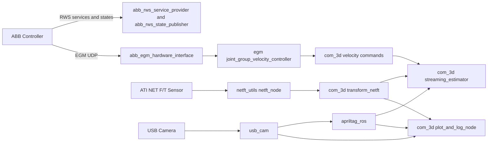
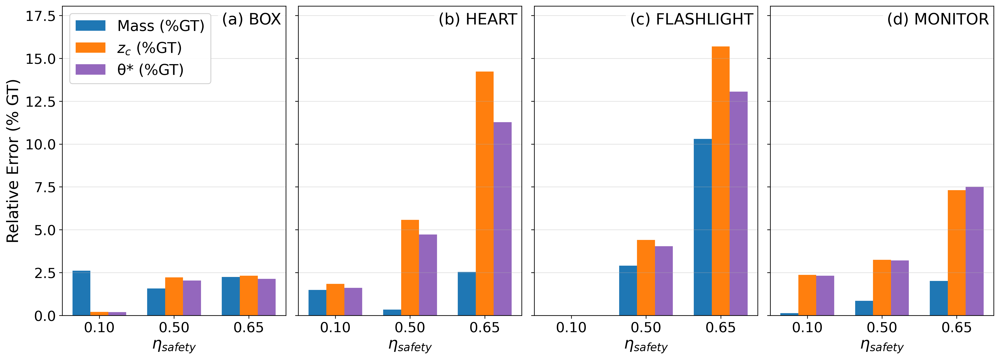
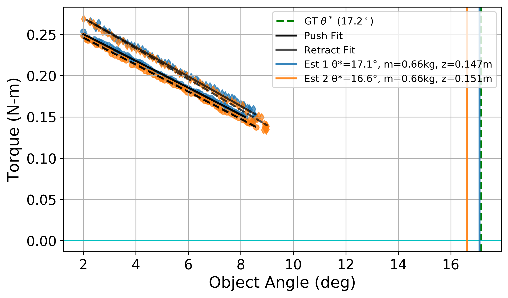

# irb120_noetic

ROS Noetic workspace layer for ABB IRB120 simulation + real-hardware bringup, with a 3D center-of-mass (CoM) estimation pipeline built on force/torque sensing and AprilTag tracking.

This repository adds the com_3d package on top of ROS-Industrial ABB packages and ties together:

- ABB Robot Web Services (RWS)
- Externally Guided Motion (EGM) velocity control
- NET F/T streaming and transform/bias handling
- Camera + AprilTag detection
- Online CoM estimation and experiment logging

## What Is In This Workspace

The full workspace is a multi-repository composition. The primary repositories under src are:

| Repository | Purpose | Main ROS packages in workspace |
| --- | --- | --- |
| abb | Robot description, Gazebo, MoveIt support | abb, abb_resources, abb_irb120_support, abb_irb120_gazebo, abb_irb120_moveit_config, abb_irb120t_moveit_config |
| abb_robot_driver | ABB hardware interfaces and services | abb_egm_hardware_interface, abb_egm_state_controller, abb_rws_service_provider, abb_rws_state_publisher, abb_robot_cpp_utilities, abb_robot_bringup_examples |
| abb_libegm | EGM protocol support library | abb_libegm |
| abb_librws | RWS protocol support library | abb_librws |
| abb_egm_rws_managers | Shared managers/utilities | abb_egm_rws_managers |
| netft_utils | ATI NET F/T ROS interface | netft_utils |
| irb120_noetic (this repo) | Project-specific integration and estimation | com_3d |

## System Architecture



## Installation

### 1. Prerequisites

Assumes Ubuntu 20.04 + ROS Noetic.

Install base tooling and common runtime dependencies:

```bash
sudo apt update
sudo apt install -y \
	python3-catkin-tools \
	python3-rosdep \
	python3-vcstool \
	python3-pip \
	ros-noetic-moveit \
	ros-noetic-apriltag-ros \
	ros-noetic-usb-cam \
	ros-noetic-rqt-plot \
	ros-noetic-rqt-image-view \
	ros-noetic-cv-bridge \
	ros-noetic-urdf-parser-py \
	ros-noetic-kdl-parser-py \
	ros-noetic-python-orocos-kdl
```

Install Python scientific dependencies used by estimator and plotting scripts:

```bash
python3 -m pip install --user numpy scipy matplotlib opencv-python
```

Initialize rosdep if needed:

```bash
sudo rosdep init
rosdep update
```

### 2. Create Or Recreate The Workspace

```bash
mkdir -p ~/irb_ws/src
cd ~/irb_ws/src

git clone https://github.com/ros-industrial/abb.git
git clone https://github.com/ros-industrial/abb_robot_driver.git
git clone https://github.com/ros-industrial/abb_libegm.git
git clone https://github.com/ros-industrial/abb_librws.git
git clone https://github.com/ros-industrial/abb_egm_rws_managers.git
git clone https://github.com/UTNuclearRoboticsPublic/netft_utils.git
git clone https://github.com/hylander2126/irb120_noetic.git
```

### 3. Install ROS Package Dependencies

From workspace root:

```bash
cd ~/irb_ws
rosdep install --from-paths src --ignore-src -r -y --rosdistro noetic
```

### 4. Build (catkin_tools)

Important: use catkin build (not catkin_make) for this workspace.

```bash
cd ~/irb_ws
catkin config --extend /opt/ros/noetic
catkin build
source devel/setup.bash
```

Optional convenience (new terminal sessions):

```bash
echo "source ~/irb_ws/devel/setup.bash" >> ~/.bashrc
```

## Figures

Example summary figure from post-processing:



Example fit plot from experiment logs:



## Quick Start

### A. Gazebo + MoveIt Simulation

Terminal 1:

```bash
cd ~/irb_ws
source /opt/ros/noetic/setup.bash
source devel/setup.bash
roslaunch abb_irb120_gazebo irb120_gazebo.launch
```

Terminal 2:

```bash
cd ~/irb_ws
source /opt/ros/noetic/setup.bash
source devel/setup.bash
roslaunch abb_irb120_moveit_config moveit_planning_execution_gazebo.launch
```

### B. Real Robot Velocity Control + Sensing + Online Estimation

Recommended one-command launch:

```bash
cd ~/irb_ws
source /opt/ros/noetic/setup.bash
source devel/setup.bash
roslaunch com_3d velocity_ctrl_irb120.launch robot_ip:=192.168.125.1
```

Helper script wrapper:

```bash
cd ~/irb_ws
./scripts/vel_ctrl_real.sh
```

Note: the helper script adds a run_base launch argument for logging runs. If your local launch file does not declare run_base, use the direct roslaunch command above.

This launch brings up:

- RWS state and service nodes
- EGM hardware interface + velocity controller
- Automated EGM/RAPID management via egm_handler.py
- NET F/T node + transform_netft.py
- USB camera + apriltag_ros
- plot_and_log_node.py and streaming_estimator.py

## Useful Control Scripts

From workspace root:

- ./scripts/restart_RAPID.sh: restart RAPID, restart EGM, and switch to trajectory controller
- ./scripts/RAPID_vel_ctrl.sh: restart RAPID, start EGM, and switch to velocity controller
- ./scripts/enable_EGM_b4_moveit.sh: starts EGM joint mode
- ./scripts/stop_EGM_RAPID.sh: stop EGM and RAPID
- ./scripts/go_home.sh: execute a single trajectory goal to zero joints
- ./scripts/get_TF.sh: tf echo base_link -> finger_tip
- ./scripts/get_TF_flange.sh: tf echo base_link -> tool0

## Core Runtime Topics And Services

Key topics used in com_3d:

- /egm/joint_group_velocity_controller/command (velocity command)
- /netft_data and /netft_data_transformed (force/torque stream)
- /tag_detections and /tag_detections_image (AprilTag stream)
- /com_3d/online_fit_debug (fit diagnostics)
- /com_3d/log_start and /com_3d/log_stop (logging control)

Key service families:

- /rws/* (RAPID and controller services)
- /rws/sm_addin/* (EGM state-machine add-in services)
- /egm/controller_manager/* (ROS controller switching)

## Data Logging And Outputs

By default, experiment artifacts are written under:

- com_3d/experiments

Typical outputs:

- timestamped CSV logs
- synchronized MP4 recordings
- fit summary text files
- generated fit/performance plots

## Network And Hardware Notes

- Set ABB controller IP via launch arg robot_ip (default in launch: 192.168.125.1).
- NET F/T sensor IP is configured in live_netft.launch and currently uses 192.168.126.125.
- Camera defaults to /dev/video0 in velocity_ctrl_irb120.launch.
- If using different hardware addresses, update launch/config values before running.

## Safety Checklist (Real Robot)

- Keep a zero-velocity command ready before enabling EGM velocity control.
- Verify E-stop accessibility and speed limits before any motion test.
- Start with low commanded velocities and empty workspace around the arm.
- Confirm controller mode and active ROS controller before publishing commands.

Example stop command:

```bash
rostopic pub -1 /egm/joint_group_velocity_controller/command std_msgs/Float64MultiArray "data: [0, 0, 0, 0, 0, 0]"
```

## Troubleshooting

- Build fails with catkin_make:
	Use catkin build for this workspace.
- No motion after launch:
	Check /rws and /rws/sm_addin services, then run ./scripts/restart_RAPID.sh.
- Missing /egm/joint_states:
	EGM session is likely not active; re-enable EGM and verify RAPID task state.
- No NET F/T stream:
	Verify sensor power, Ethernet route, and IP in live_netft.launch.
- No AprilTag detections:
	Validate camera stream, calibration file path, and tag settings YAML files.

## Upstream References

- https://github.com/ros-industrial/abb
- https://github.com/ros-industrial/abb_robot_driver
- https://github.com/ros-industrial/abb_libegm
- https://github.com/ros-industrial/abb_librws
- https://github.com/ros-industrial/abb_egm_rws_managers
- https://github.com/UTNuclearRoboticsPublic/netft_utils
